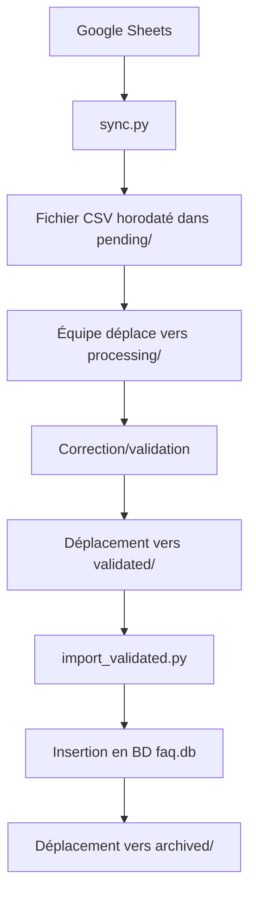

# ChatBot FAQ Management System

Un système automatisé pour gérer les FAQ d'un chatbot, avec synchronisation depuis Google Sheets, validation manuelle et insertion en base de données SQLite.

## Fonctionnalités

- **Synchronisation automatique** : Récupération des données depuis une feuille Google Sheets
- **Validation manuelle** : Processus de validation par l'équipe avant insertion
- **Archivage automatique** : Traçabilité historique des fichiers traités
- **Base de données SQLite** : Stockage structuré des FAQ
- **Logging** : Suivi des succès/échecs des opérations

## Structure du Projet

```
ChatBot/
│
├── docs/
│   ├── latex/
│   │   ├── configuration.tex    # Documentation LaTeX
│   │   ├── images/
│   │   │   └── logo_supptic.png # Logo pour la doc
│   │   └── *.aux, *.log, etc.   # Fichiers de compilation LaTeX
│   └── README.md                # Ce fichier
│
├── scripts/
│   ├── sync.py                  # Script de collecte (Google Sheet → data/pending)
│   └── import_validated.py      # Script d’insertion (data/validated → db → data/archived)
│
├── data/
│   ├── pending/                 # Fichiers bruts en attente de validation
│   ├── processing/              # Fichiers en cours de traitement par l’équipe
│   ├── validated/               # Fichiers corrigés et validés
│   └── archived/                # Fichiers déjà insérés en BD (trace historique)
│
├── db/
│   └── faq.db                   # Base SQLite
│
├── config/
│   └── faq-service-key.json     # Clé de service Google (non versionnée)
│
├── logs/
│   └── sync.log                 # Journal des synchronisations
│
├── tests/                       # Tests unitaires (futurs)
│
├── .gitignore                   # Patterns d'exclusion Git
├── requirements.txt             # Dépendances Python
└── README.md                    # Documentation du projet
```

## Cycle de Vie des Fichiers



1. `sync.py` crée un fichier horodaté dans `data/pending/` (ex: `new_data_2026-01-04_04-05.csv`)
2. L'équipe déplace manuellement vers `data/processing/` quand quelqu'un prend en charge
3. Après correction, le fichier est placé dans `data/validated/`
4. `import_validated.py` lit les fichiers dans `data/validated/`, les insère dans `db/faq.db`, puis les déplace vers `data/archived/`

## Installation

1. Cloner le dépôt
2. Installer les dépendances :
   ```bash
   pip install -r requirements.txt
   ```
3. Placer votre clé de service Google dans `config/faq-service-key.json`
4. Créer la structure de dossiers (ou utiliser le script d'initialisation)

## Utilisation

### Synchronisation des données

```bash
python scripts/sync.py
```

- Vérifie la connexion internet
- Récupère les données de Google Sheets
- Crée un fichier CSV dans `data/pending/`
- Log l'opération dans `logs/sync.log`

### Import des données validées

```bash
python scripts/import_validated.py
```

- Lit tous les fichiers CSV dans `data/validated/`
- Insère les données dans `db/faq.db`
- Déplace les fichiers vers `data/archived/`

### Reset et réimport complet

Pour recommencer à zéro (supprimer DB, remettre archived en validated et réimporter) :

```bash
python scripts/reset_and_import.py
```

## Base de Données

La table `faq` dans `db/faq.db` contient :

- `id` : Clé primaire auto-incrémentée
- `question` : Texte de la question
- `answer` : Texte de la réponse

## Logs

Toutes les opérations sont tracées dans `logs/sync.log` avec timestamps.

## Documentation

La documentation technique est disponible dans `docs/latex/configuration.tex` (format LaTeX). Pour compiler :

```bash
cd docs/latex
pdflatex configuration.tex
```

## Sécurité

- La clé de service Google (`config/faq-service-key.json`) n'est pas versionnée
- Seules les données validées sont insérées en base
- Archivage pour traçabilité

## Contribution

1. Créer une branche pour vos modifications
2. Tester les scripts
3. Mettre à jour la documentation si nécessaire

## Licence

[À définir]</content>
<parameter name="filePath">c:\Users\DELL\Desktop\ChatBot\README.md
