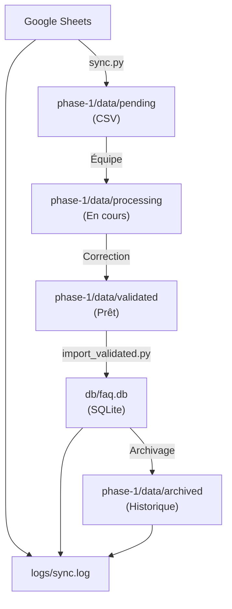

# Architecture du Système - ChatBot

## Vue d'ensemble

```
┌─────────────────────────────────────────────────────────────┐
│                    ChatBot Project                          │
├─────────────────────────────────────────────────────────────┤
│                                                               │
│  Phase 1 (FAQ Mgmt)  Phase 2 (NLP)  Phase 3+ ...           │
│  ┌──────────────┐   ┌──────────────┐                        │
│  │  FAQ System  │   │   Chatbot    │                        │
│  │  Scripts     │   │   Core       │                        │
│  │  Data        │   │   Scripts    │                        │
│  └──────────────┘   └──────────────┘                        │
│          │                   │                               │
│          └───────────┬───────┘                               │
│                      │                                       │
│          ┌───────────▼────────────┐                          │
│          │   Base Partagée        │                          │
│          │   db/faq.db (SQLite)   │                          │
│          └────────────────────────┘                          │
│                      │                                       │
│          ┌───────────▼────────────┐                          │
│          │   Logs Centralisés     │                          │
│          │   logs/*.log           │                          │
│          └────────────────────────┘                          │
│                                                               │
└─────────────────────────────────────────────────────────────┘
```

## Flux de Données

### Phase 1 (Collecte et Validation)



## Organisation des Phases

### Chaque phase contient :

```
phase-N/
├── scripts/          # Code d'exécution
├── data/             # Données temporaires
├── config/           # Configuration spécifique
└── tests/            # Tests de la phase
```

### Ressources partagées :

```
/
├── db/               # Base de données commune
├── logs/             # Logs de toutes les phases
├── requirements.txt  # Dépendances globales
└── docs/             # Documentation globale + par phase
```

## Base de Données

**Type** : SQLite (`db/faq.db`)

**Schéma actuel (Phase 1)** :

```sql
CREATE TABLE faq (
    id INTEGER PRIMARY KEY AUTOINCREMENT,
    question TEXT NOT NULL,
    answer TEXT NOT NULL
);
```

**Évolution** : Le schéma peut être enrichi dans les phases futures.

## Configuration

### Phase 1

- `phase-1/config/faq-service-key.json` : Clé de service Google (non versionnée)
- Paramètres dans les scripts

### Futures phases

Chaque phase aura sa propre configuration dans `phase-N/config/`

## Logs

**Centralisation** : `logs/`

Chaque phase génère ses logs :

- `logs/phase-1-sync.log`
- `logs/phase-1-import.log`
- `logs/phase-2-*.log` (à venir)

---

Pour plus d'informations :

- 📖 [Phases du projet](PHASES.md)
- 📖 [Vue d'ensemble](PROJECT_OVERVIEW.md)
- 📖 [Documentation Phase 1](phase-1/README.md)
