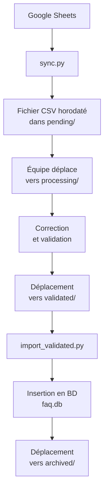

# Phase 1 : Collecte et Validation des Données

## 📝 Description

Phase 1 du ChatBot FAQ Management System.

Un système automatisé pour gérer les FAQ d'un chatbot, avec synchronisation depuis Google Sheets, validation manuelle et insertion en base de données SQLite.

## ✨ Fonctionnalités

- **Synchronisation automatique** : Récupération des données depuis une feuille Google Sheets
- **Validation manuelle** : Processus de validation par l'équipe avant insertion
- **Archivage automatique** : Traçabilité historique des fichiers traités
- **Base de données SQLite** : Stockage structuré des FAQ
- **Logging** : Suivi des succès/échecs des opérations

## 📁 Structure

```
phase-1/
│
├── scripts/
│   ├── sync.py                  # Script de collecte (Google Sheet → data/pending)
│   ├── import_validated.py      # Script d'insertion (data/validated → db → data/archived)
│   └── reset_and_import.py      # Script de reset et réimport complet
│
├── data/
│   ├── last_row.txt             # Suivi du dernier index traité
│   ├── pending/                 # Fichiers bruts en attente de validation
│   ├── processing/              # Fichiers en cours de traitement par l'équipe
│   ├── validated/               # Fichiers corrigés et validés
│   └── archived/                # Fichiers déjà insérés en BD (trace historique)
│
├── config/
│   └── faq-service-key.json     # Clé de service Google (non versionnée)
│
└── tests/
    └── test_db.py               # Script de test de la base de données
```

## 🔄 Cycle de Vie des Fichiers



### Étapes détaillées

1. **sync.py** crée un fichier horodaté dans `phase-1/data/pending/` (ex: `new_data_2026-01-04_04-05.csv`)
2. L'équipe déplace manuellement vers `phase-1/data/processing/` quand quelqu'un prend en charge
3. Après correction, le fichier est placé dans `phase-1/data/validated/`
4. **import_validated.py** lit les fichiers dans `phase-1/data/validated/`, les insère dans `db/faq.db`, puis les déplace vers `phase-1/data/archived/`

## 📖 Guides

- 🔧 [Installation et Configuration](SETUP.md)
- 🚀 [Guide d'Utilisation](USAGE.md)

## 🔐 Sécurité

- La clé de service Google (`phase-1/config/faq-service-key.json`) n'est pas versionnée
- Seules les données validées sont insérées en base
- Archivage pour traçabilité

---

Pour la vue d'ensemble du projet : 📖 [Aller au README principal](../PROJECT_OVERVIEW.md)
